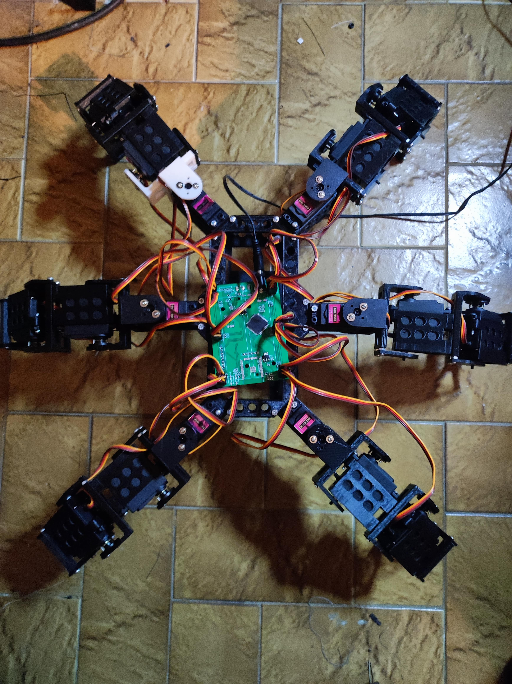
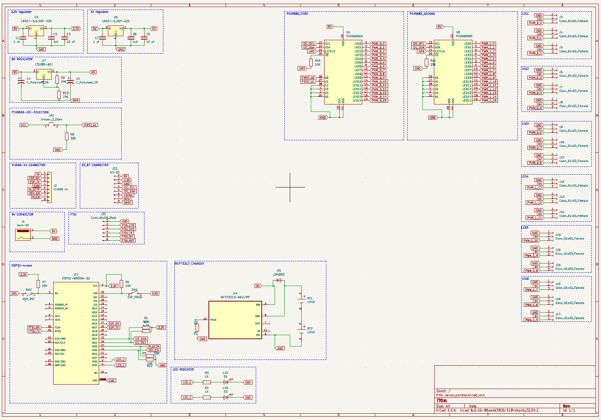
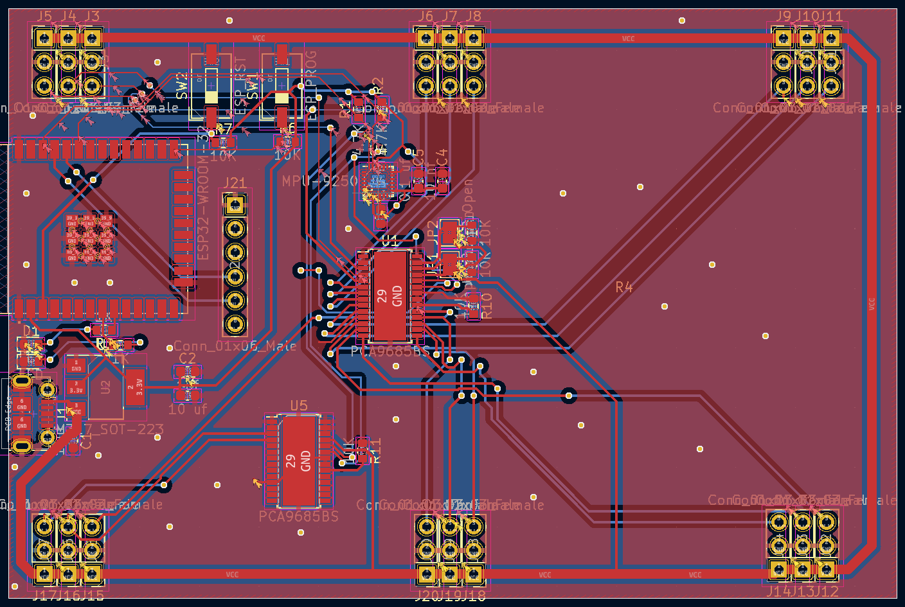
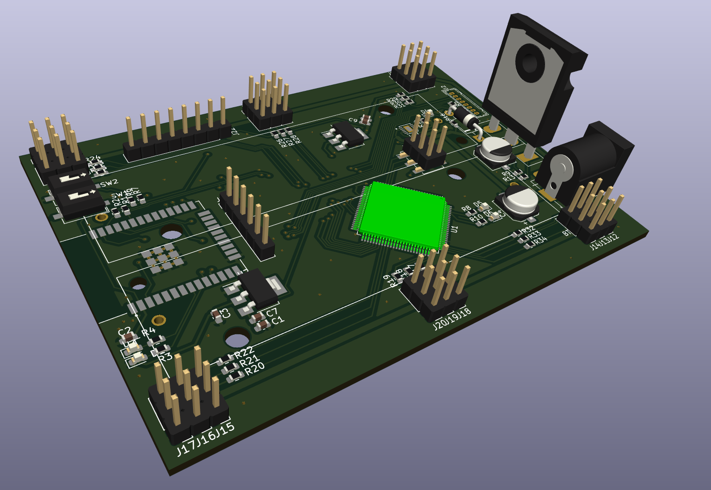

# Hexapod project

# ON HER LEGS

### Circuit schema with 18 servos connectors.

### PCB View

### 3D View

#### Info
In my hexapod project, i will create a specific pcb with ESP32 for online 
control.

All mcu are connected with I2C bus.

TODO
- [x] Add PCA9685-16 for control servos
- [x] add esp32 
- [x] add MCP9250
- [x] send pcb to JLCPCB
- [x] add lipo 2s charger
- [ ] change esp32 by a k210 kendryte